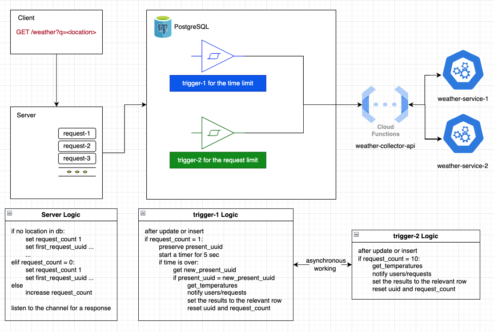

<h2>Setup:</h2>

**Api urls have to be created and added like so:**
- Add the api url you'll take from https://www.weatherapi.com/ to .functions/weather-collector-function.go:60
- Add the api url you'll take from https://weatherstack.com/ to .functions/weather-collector-function.go:90 

**HOWEVER** \
If you do not want to interfere with it, then do not do this because I have already published mine https://weather-collector-function.ercant.net?location=<location\> 

---

A rough outline of the system

